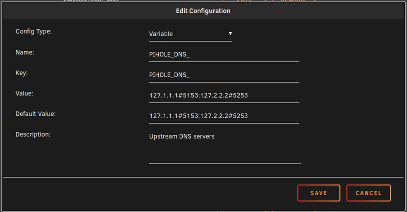

<!-- yet-another-pihole-dot-doh by ChaseCares -->
# Yet Another Pi-hole DoT DoH

This repository extends the official [Pi-hole](https://github.com/pi-hole/docker-pi-hole) image, by adding [Cloudflared](https://github.com/cloudflare/cloudflared) for [DNS-Over-HTTPS](https://en.wikipedia.org/wiki/DNS_over_HTTPS) and [Stubby](https://github.com/getdnsapi/stubby) for [DNS-Over-TLS](https://en.wikipedia.org/wiki/DNS_over_TLS).

## Features

+ Multi-architecture support (386, x86-64, arm, amd, arm64)
+ Only 56MB of additional space over official Pi-hole image
+ Cloudflared for DNS-Over-HTTPS
+ Stubby for DNS-Over-TLS
+ Drop in compatibility with existing Pi-hole DoT DoH image*

\* Make sure your environment variables are up to date.

## Methodology

When creating this image, extra attention was given to following best practices, style, and methodology of the upstream projects.

For example, cloudflared and stubby are managed by [s6 overlay](https://github.com/just-containers/s6-overlay#the-docker-way), utilizing the same structure as Pi-hole.

The Dockerfile utilizes native directives when possible, and no additional packages are added other than Cloudflared and Stubby, adding only 56MB of additional space.

## Getting Started

### Unraid

If you have a working Pi-hole DoT DoH container, you change the repository to: `chasecares/yet-another-pihole-dot-doh:latest` and it should work.

#### Unraid Notes

You may need to update some environmental variables that are currently deprecated.

If `DNS1` and `DNS2` are present, remove them and add a new variable with the following values:

+ Config Type: variable
+ Name: PIHOLE_DNS_
+ Key: PIHOLE_DNS_
+ Value: 127.1.1.1#5153;127.2.2.2#5253
+ Default Value: 127.1.1.1#5153;127.2.2.2#5253
+ Description: Upstream DNS servers



If `ServerIP` or `FTLCONF_REPLY_ADDR4` and/or `ServerIPv6` or `FTLCONF_REPLY_ADDR6` are present, remove them and do the following:

Replace `ServerIP` or `FTLCONF_REPLY_ADDR4` with the following:

+ Config Type: variable
+ Name: FTLCONF_LOCAL_IPV4
+ Key: FTLCONF_LOCAL_IPV4
+ Value: < Your servers IPv4 address >
+ Default Value:
+ Description: Set to your server's LAN IP, used by web block modes and lighttpd bind address

Replace `ServerIPv6` or `FTLCONF_REPLY_ADDR6` with the following:

+ Config Type: variable
+ Name: FTLCONF_LOCAL_IPV6
+ Key: FTLCONF_LOCAL_IPV6
+ Value: < Your servers IPv6 address >
+ Default Value:
+ Description:

### Docker

If you're starting from scratch, I would recommend setting up the official Pi-hole image utilizing their instructions and then make the changes to add this image.

#### Docker Run

Pi-hole offers a good example run script [here](https://github.com/pi-hole/docker-pi-hole/blob/master/examples/docker_run.sh).

If you already have a Pi-hole image running, you can switch to this image by making the following changes:

Add `-e PIHOLE_DNS_="127.1.1.1#5153;127.2.2.2#5253"` after `-e FTLCONF_LOCAL_IPV4="127.0.0.1" \`

Change `pihole/pihole:latest` to `chasecares/yet-another-pihole-dot-doh:latest`

This will run the image with the default config files. If you want to modify these, add `-v "${PIHOLE_BASE}/config:/config" \` after `-v "${PIHOLE_BASE}/etc-dnsmasq.d:/etc/dnsmasq.d" \` and your changes will be persistent.

#### Docker Compose

Pi-hole offers a good Docker compose example file [here](https://github.com/pi-hole/docker-pi-hole#quick-start).

If you already have a Pi-hole image running, you can switch to this image by making the following changes:

change `image: pihole/pihole:latest` to `image: docker pull chasecares/yet-another-pihole-dot-doh:latest`

This will run the image with the default config files. If you want to modify these, add `- './config:/config'` under `volumes:` and your changes will be persistent.

Full compose file:

``` yaml
version: "3"

# More info at https://github.com/pi-hole/docker-pi-hole/ and https://docs.pi-hole.net/
services:
  pihole:
    container_name: pihole
    image: chasecares/yet-another-pihole-dot-doh:latest
    # For DHCP it is recommended to remove these ports and instead add: network_mode: "host"
    ports:
      - "53:53/tcp"
      - "53:53/udp"
      - "67:67/udp" # Only required if you are using Pi-hole as your DHCP server
      - "80:80/tcp"
    environment:
      TZ: 'America/Chicago'
      # WEBPASSWORD: 'set a secure password here or it will be random'
    # Volumes store your data between container upgrades
    volumes:
      - './etc-pihole:/etc/pihole'
      - './etc-dnsmasq.d:/etc/dnsmasq.d'
      - './config:/config'
    #   https://github.com/pi-hole/docker-pi-hole#note-on-capabilities
    cap_add:
      - NET_ADMIN # Required if you are using Pi-hole as your DHCP server, else not needed
    restart: unless-stopped
```

#### Docker Notes

Currently Docker compose is untested (it *should* work!). I don't use Docker compose. If you use it and it works for you, open an issue and let me know!

## Configs

The image comes with two pre-configured config files, [cloudflared.yml](./src/config/cloudflared.yml) and [stubby.yml](./src/config/stubby.yml), which are available at `/config`. If a file already exists, it won't be overwritten; therefore, you are free to make changes to these configs.
If you have recommendations for improving them, definitely open a issue and let me know.

## Works Cited

[Pi-hole official image](https://github.com/pi-hole/docker-pi-hole)
Was utilized to maintain consistency and similar methodology

[Pi-hole cloudflared docs](https://docs.pi-hole.net/guides/dns/cloudflared/)
Was used for still set up commands and a starting configuration

[s6 overlay](https://github.com/just-containers/s6-overlay)
Was used to understand how to set up an app for s6 to manage

[Stubby](https://github.com/getdnsapi/stubby)
Was used for general documentation and the starting configuration file

[The Docker docs](https://docs.docker.com/develop/develop-images/dockerfile_best-practices/)
Was used for general information about creating a good Docker file

[testdasi's Pi-hole DoT DoH](https://github.com/testdasi/pihole-dot-doh)
And of course, testdasi's awesome work was a great starting point to understand the big picture and how to get the applications communicating with each other. Thanks!
